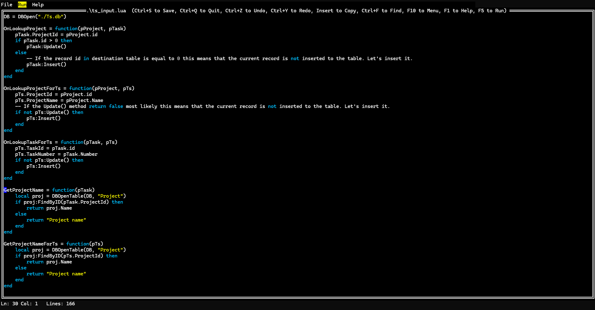
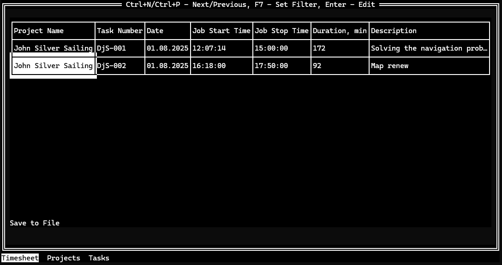

# GotuLua

Gotulua - All-in-one Go-powered environment for building Lua scripts with text-based UIs and SQLite integration. Features a built-in editor, Lua runtime (Shopify/go-lua), TUI component library, and interactive help system. Distributed as a single binary with zero dependencies for Windows and Linux.

## Features

- SQLite database operations through Lua scripts
- Text-based User Interface (TUI) for database interaction
- Table browsing and editing capabilities
- Lookup functionality for related tables
- Custom field types (Text, Integer, Date, Time, Boolean, Float)
- Customizable table structures
- Event handling for database operations (OnAfterInsert, OnAfterUpdate, etc.)




## Installation

- Binaries for Windows and Linux are available in the [release] https://github.com/LobachevEB/gotulua/releases page.

1. Ensure you have Go 1.22.0 or later installed
2. Clone the repository
3. Install dependencies:
```sh
go mod download
```

## Run the application
```sh
./gotulua [-e] [script]
```

## Basic Usage

1. Create a new database and tables:
```lua
-- Initialize database
DB = DBCreate("./MyDatabase.db")

-- Create tables
DBCreateTable(DB, "TableName", "n::Field1;t::Text;l::100|n::Field2;t::Integer", true)
```

2. Open existing database:
```lua
DB = DBOpen("./MyDatabase.db")
```

3. Create a browse interface:
```lua
-- Open table
myTable = DBOpenTable(DB, "TableName")

-- Create browse interface
browse = AddBrowse(myTable, "Browse Title")

-- Add fields to browse
browse:AddField("n::Field1;c::Caption1;e::true")

-- Show the browse interface
browse:Show()
```

## Field Definition Format

Fields are defined using a structured string format:
- `n::` - Field name
- `t::` - Field type (Text, Integer, Date, Time, Boolean, Float)
- `l::` - Field length (for Text fields)
- `c::` - Display caption
- `e::` - Editable flag (true/false)
- `f::` - Function name for calculated fields

Example:
```lua
"n::Name;t::Text;l::100|n::Age;t::Integer"
```

## Browse and Lookup Features

- Create browse interfaces with `AddBrowse()`
- Create lookup windows with `AddLookup()`
- Link fields with lookups using `SetFieldLookup()`
- Add custom buttons with `AddButton()`

## Event Handlers

Define custom behavior for database operations:
```lua
-- After insert handler
table:SetOnAfterInsert('MyInsertHandler')

-- After update handler
table:SetOnAfterUpdate('MyUpdateHandler')

-- After delete handler
table:SetOnAfterDelete('MyDeleteHandler')
```

## Database Functions

- `DBOpen(path)` - Open database
- `DBClose(db)` - Close database
- `DBCreateTable(db, name, structure, openIfExists)` - Create table
- `DBOpenTable(db, name)` - Open existing table
- `DBDropTable(db, name)` - Drop table
- `DBAlterTable(db, name, structure)` - Alter table structure

## Dependencies

- github.com/Shopify/go-lua - Lua interpreter
- github.com/gdamore/tcell/v2 - Terminal handling
- github.com/rivo/tview - Terminal UI library
- gorm.io/gorm - ORM library
- gorm.io/driver/sqlite - SQLite driver

## License

MIT License

Copyright (c) 2025 LobachevEB

Permission is hereby granted, free of charge, to any person obtaining a copy
of this software and associated documentation files (the "Software"), to deal
in the Software without restriction, including without limitation the rights
to use, copy, modify, merge, publish, distribute, sublicense, and/or sell
copies of the Software, and to permit persons to whom the Software is
furnished to do so, subject to the following conditions:

The above copyright notice and this permission notice shall be included in all
copies or substantial portions of the Software.

THE SOFTWARE IS PROVIDED "AS IS", WITHOUT WARRANTY OF ANY KIND, EXPRESS OR
IMPLIED, INCLUDING BUT NOT LIMITED TO THE WARRANTIES OF MERCHANTABILITY,
FITNESS FOR A PARTICULAR PURPOSE AND NONINFRINGEMENT. IN NO EVENT SHALL THE
AUTHORS OR COPYRIGHT HOLDERS BE LIABLE FOR ANY CLAIM, DAMAGES OR OTHER
LIABILITY, WHETHER IN AN ACTION OF CONTRACT, TORT OR OTHERWISE, ARISING FROM,
OUT OF OR IN CONNECTION WITH THE SOFTWARE OR THE USE OR OTHER DEALINGS IN THE
SOFTWARE.